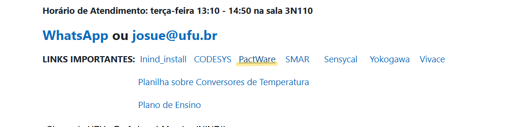
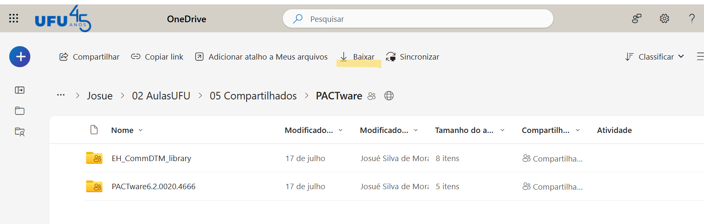
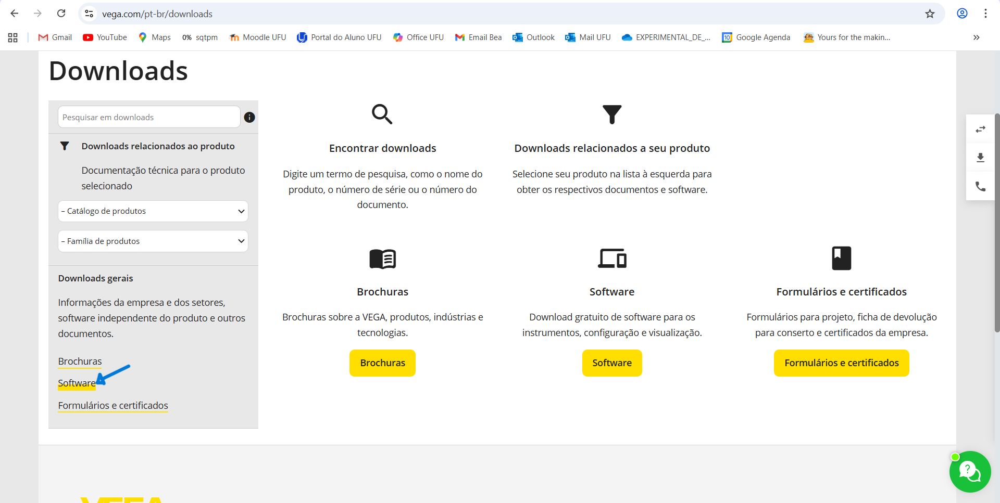
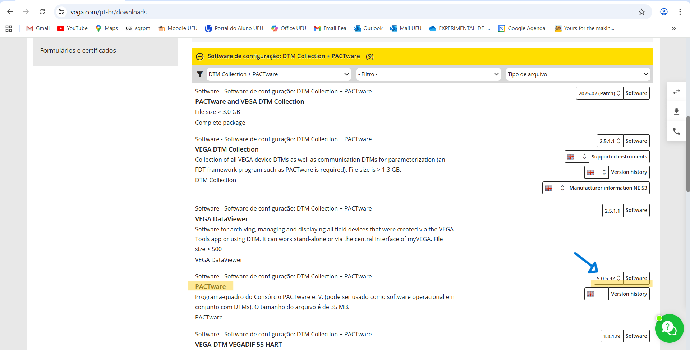
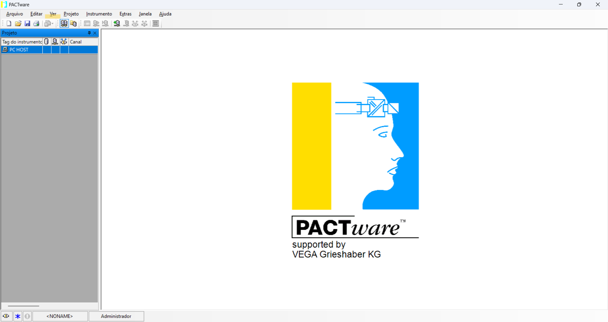
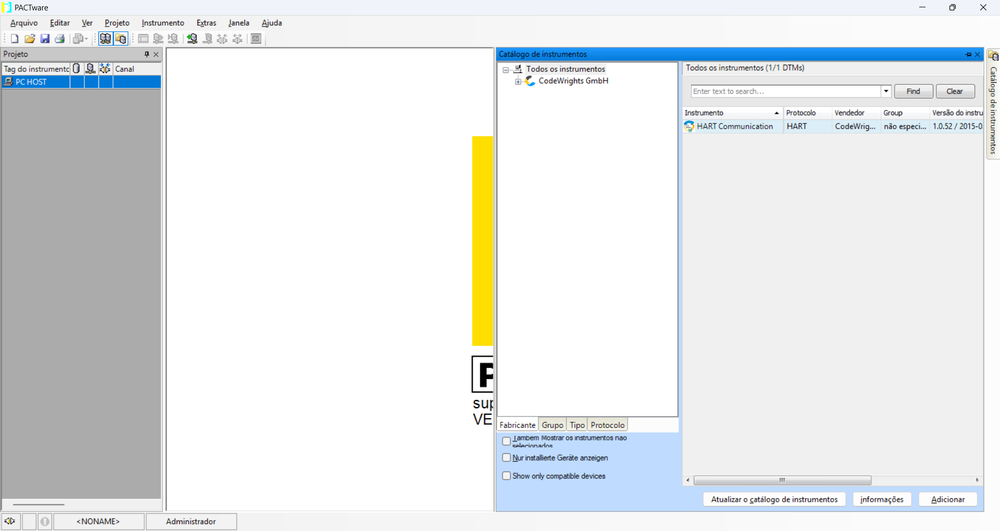
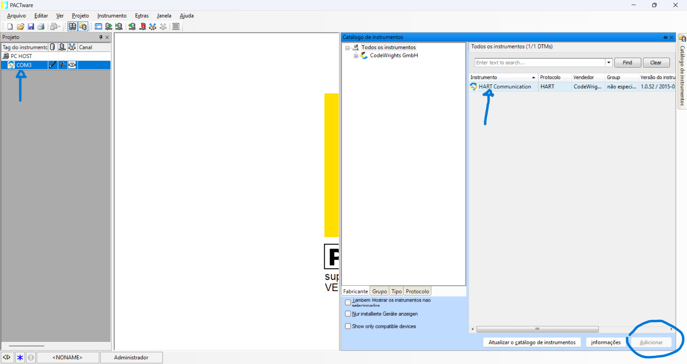
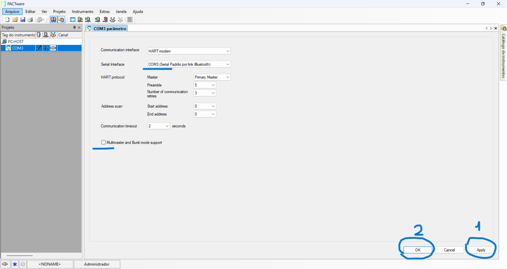
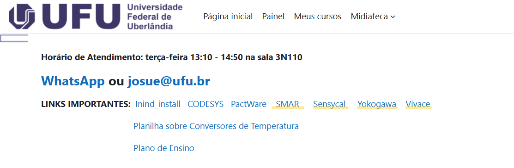

# 📘 EININIDII – PACTware + Controle de Nível
> **Professor**: Josué Morais  
> **Disciplina**: Instrumentação Industrial II  
> **Curso**: Engenharia de Controle e Automação  
> **Instituição**: Universidade Federal de Uberlândia — FEELT  

---

## Colaboradores

Este projeto é resultado de um esforço conjunto. A participação das pessoas abaixo foi essencial:

- **Beatriz Maximo Borges de Souza** - 12211EAU021
- **Giovana Soares Porto** - 12221EAU004

A cada um(a), nosso agradecimento pelo compromisso, pela parceria e pela qualidade do trabalho entregue.

---

## 📑 Índice
- [1. Introdução](#1-introdução)
- [2. Objetivo](#2-objetivo)
- [3. PACTware](#3-pactware)
  - [3.1. Instalando o PACTware](#31-instalando-o-pactware)
  - [3.2. Configurações Iniciais do PACTware](#32-configurações-iniciais-do-pactware)
  - [3.3. Informações Adicionais](#33-informações-adicionais)

---

## 1. Introdução

O **PACTware** é uma ferramenta de software baseada em FDT/DTM amplamente utilizada para configuração, parametrização, diagnóstico e manutenção de instrumentos de campo. Sua aplicação proporciona maior integração entre dispositivos de diferentes fabricantes, permitindo um ambiente unificado para gestão de instrumentos, contribuindo para maior eficiência e confiabilidade dos processos.

---

## 2. Objetivo

Este relatório tem por objetivo servir de roteiro de aula da disciplina de Instrumentação Industrial II e, posteriormente, auxiliar os alunos em suas aulas práticas. Além disso, objetiva-se abordar tópicos fundamentais para o entendimento e a prática no ambiente de aula e no ambiente industrial, como o uso do PACTware e os princípios e ferramentas de Controle de Nível.

---

## 3. PACTware

### 3.1. Instalando o PACTware

É possível fazer a instalação do PACTware através do link disponibilizado no painel do Moodle em "LINKS IMPORTANTES", conforme disposto na Figura 1.

Ao acessar o link, você será redirecionado para uma pasta do OneDrive contendo as pastas que devem ser baixadas (Figura 2). A versão disponível neste link é a mais recente (PACTware 6.2), enquanto a versão utilizada nas aulas práticas é a 5.0.

Para instalar a versão 5.0, acesse sites onde o software esteja disponível para download, como o **'VEGA - Home of values'** (link nas Referências). No site, clique na página de 'Downloads' e depois em 'Software'.

No tópico 'Software de configuração: DTM Collection + PACTware', selecione a versão 5.0 do PACTware e faça o download.

Após o download, execute o instalador seguindo as instruções nas telas (geralmente clicando em 'Next', 'Finish' e 'Install').

### 3.2. Configurações Iniciais do PACTware

Após a instalação, são necessárias algumas configurações para iniciar um projeto. Na tela inicial do PACTware, clique em **'Ver'**.

Em seguida, clique em **'Catálogo de instrumentos'**. Uma aba será aberta na lateral direita da tela.

Na aba aberta, clique em **'Atualizar o catálogo de instrumentos'**. Selecione o instrumento a ser utilizado (exemplo: HART) e adicione-o. O instrumento aparecerá na coluna do lado esquerdo.

Clique duas vezes em **'COM3'** (instrumento adicionado). Na tela que abrir, desmarque **'Multimaster and Burst mode support'** e altere a Serial Interface se necessário. Clique em **'apply'** e depois em **'Ok'**.

Clique com o botão direito em **'COM3'** e selecione **'adicionar instrumento'**. Procure o nome do transmissor, dê dois cliques e feche a tela. Novamente, dê dois cliques no transmissor adicionado para abrir suas configurações. Com o botão direito no transmissor, conecte-o. Se os ícones ficarem verdes, as informações do transmissor aparecerão na tela.

Para finalizar, altere as configurações desejadas, salve clicando em **'Write'** e confira as mudanças no display do transmissor.

### 3.3. Informações Adicionais

É necessário fazer o download do **DTM** (Device Type Manager), um componente de software específico do fabricante que permite configurar, parametrizar e diagnosticar instrumentos de campo usando protocolos como HART ou Profibus.

Para isso, acesse o Moodle e clique no protocolo desejado na área de **'LINKS IMPORTANTES'**, conforme mostra a Figura 10. Você será redirecionado para uma pasta no OneDrive onde poderá instalar o DTM desejado.

---

# Portable HART-IP Commands

From UniversalCommandList.json

| | |
|:--|:--|
| -| **Universal**|
| 1  | Read Primary Variable|
| 2  | Read Loop Current And Percent Of Range|
| 3  | Read Dynamic Variables And Loop Current|
| 6  | Write Polling Address|
| 7  | Read Loop Configuration|
| 8  | Read Dynamic Variable Classifications|
| 9  | Read Device Variables with Status|
| 11 | Read Unique Identifier Associated With Tag|
| 12 | Read Message|
| 13 | Read Tag, Descriptor, Date|
| 14 | Read Primary Variable Transducer Information|
| 15 | Read Device Information|
| 16 | Read Final Assembly Number|
| 17 | Write Message|
| 18 | Write Tag, Descriptor, Date|
| 19 | Write Final Assembly Number|
| 20 | Read Long Tag|
| 21 | Read Unique Identifier Associated With Long Tag|
| 22 | Write Long Tag|
| 38 | Reset Configuration Changed Flag|
| 48 | Read Additional Device Status|
| -| **Common Practice** |
| 50 | Read Dynamic Variable Assignments|
| 74 | Read I/O System Capabilities|
| 77 | Send Command to Sub-Device|
| 84 | Read Sub-Device Identity Summary|
| 101| Read Sub-Device to Burst Message Map|
| 103| Write Burst Period|
| 105| Read Burst Mode Configuration|
| 108| Write Burst Mode Command Number|
| 118| Event Notification Control|
| 119| Acknowledge Event Notification|
| 520| Read Process Unit Tag|
| 521| Write Process Unit Tag|
| 532| Read Client Subscription Summary|
| 533| Write Client Subscription Flags|
| 538| Read HART-IP Server Ports|
| 539| Write HART-IP UDP Port|
| 540| Write HART-IP TCP Port|
| 541| Write Client PAKE Password|
| 542| Write Client Pre-Shared Key|
| 543| Read syslog Server HOSTNAME and Port|
| 544| Write syslog Port|
| 545| Write syslog Server HOSTNAME|
| 546| Write syslog Server Pre-Shared Key|
| 547| Write syslog Server PAKE Password|
| -| **Wireless** |
| 774| Read Network ID|
| 779| Report Device Health|
| 780| Neighbor Health List|
| 787| Report Neighbor Signal Levels|
| 833| Read Device's Neighbor Health|
| 834| Read Network Topology Information|
| 840| Read Device's Statistics|